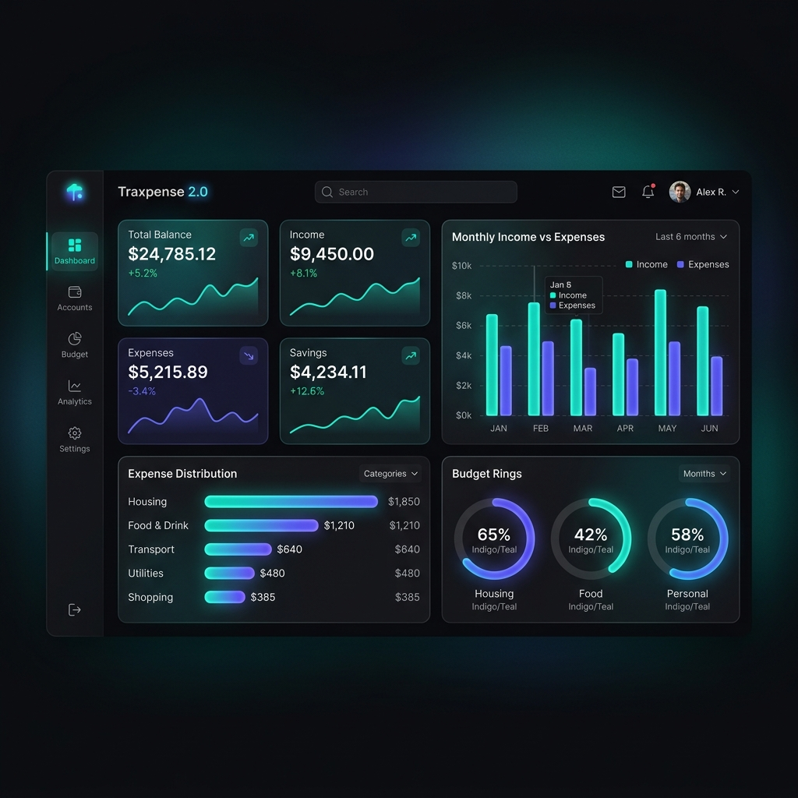
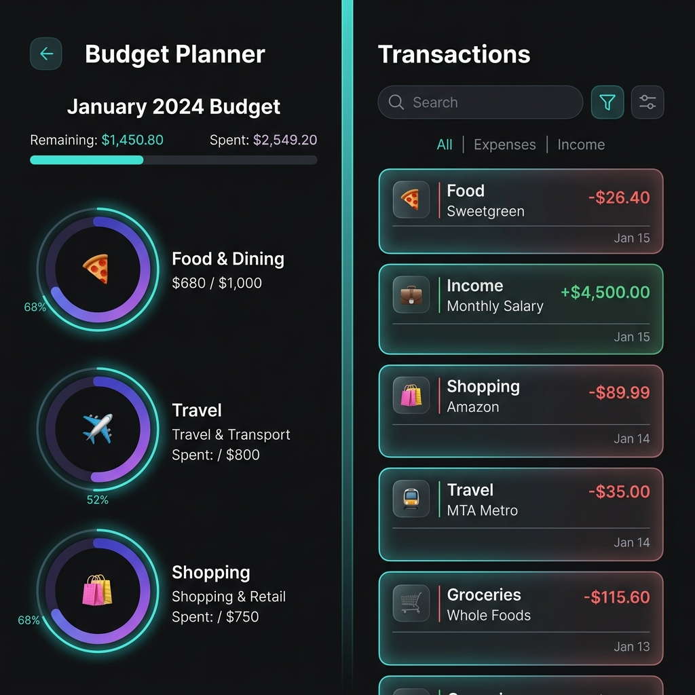

<div align="center">


# Traxpense 2.0 💰

**Your Personal Finance, Reimagined.**

A beautifully designed, full-stack expense tracking application built for people who take their finances seriously. Track every rupee, visualize your habits, and take control of your financial future.

[](https://nextjs.org/)
[](https://fastapi.tiangolo.com/)
[](https://www.mysql.com/)
[](https://www.python.org/)
[](LICENSE)

</div>

---

<div align="center">



*A premium, dark-mode financial dashboard with real-time insights.*

</div>

---

## ✨ Overview

Traxpense 2.0 is a **production-grade personal finance tracker** that goes far beyond just logging transactions. With a meticulously crafted UI, real-time analytics, and an intelligent budgeting engine, Traxpense empowers you to understand where your money goes — and make smarter decisions every day.

> Built with a modern **Next.js 15** frontend and a robust **FastAPI** backend, Traxpense delivers a fast, responsive, and visually stunning experience on any device.

---

## 🚀 Core Features

<div align="center">



*Budgets with circular progress rings and a filterable, categorized transaction list.*

</div>

### 📊 Smart Dashboard
- **4 KPI Cards** — Total Balance, Income, Expenses & Savings at a glance
- **Income vs Expenses** — Grouped bar chart with monthly breakdowns
- **Expense Distribution** — Horizontal bar chart by category
- **Recent Transactions** — Live feed of your latest activity
- **Timeframe Selector** — View data for Today, This Week, This Month, Last Month, or a Custom Range

### 💳 Transaction Management
- Add, edit, and delete transactions instantly
- Filter by **date range**, **category**, **type** (income/expense), and **amount**
- Smart search with modern filter card UI
- Paginated transaction list with real-time updates

### 💰 Budget Planner
- Set monthly budgets per category
- **Circular SVG progress rings** showing real-time spending vs. budget
- Color-coded status: On Track 🟢 / Warning 🟡 / Over Budget 🔴
- View **Previous Month** budget performance for historical context

### 📂 Category Management
- Create, edit, and delete custom expense categories
- Assign emojis and colors for at-a-glance identification
- Category-level spending analytics

### 📅 Calendar View
- Visual monthly calendar with daily transaction indicators
- Click any day to see a detailed breakdown of that day's activity

### 📈 Reports
- Monthly trend analysis
- Category-wise spending breakdown
- Income vs. Expense comparison over time

### 🎨 Modern UI/UX
- **Dark Mode First** design with glassmorphic cards
- Smooth micro-animations on every interaction
- Fully responsive — works great on desktop and mobile
- Dual-arrow collapsible sidebar for maximum screen real estate

---

## 🔮 Upcoming Features

<div align="center">


*A sneak peek at the AI-powered insights engine coming soon to Traxpense.*

</div>

### 🤖 AI Insights & Analytics *(Coming Soon)*
An intelligent financial co-pilot built right into Traxpense:
- **Spending Pattern Analysis** — AI identifies your habits and anomalies automatically
- **Budget Recommendations** — Smart suggestions based on your history
- **Predictive Forecasting** — See where your finances are headed next month
- **Natural Language Chat** — Ask your finances questions like *"How much did I spend on food last month?"*
- **Subscription Detection** — Auto-flag recurring charges you might have forgotten about

### ⚡ Auto-Add Transactions *(Coming Soon)*
Say goodbye to manual entry:
- **SMS & Email Parsing** — Automatically detect and log bank transactions from notifications
- **Smart Categorization** — AI pre-fills category, merchant, and amount
- **One-Tap Confirm** — Review and approve auto-detected transactions in seconds
- **Bank Statement Import** — Upload CSV/PDF bank statements for bulk import

---

## 🛠️ Tech Stack

| Layer | Technology |
|-------|-----------|
| **Frontend** | Next.js 15 (App Router), React 18, CSS Modules |
| **Backend** | FastAPI (Python 3.11+), SQLAlchemy ORM |
| **Database** | MySQL 8.0 (via PyMySQL) |
| **Charts** | Recharts |
| **Auth** | JWT (Bearer Token) |
| **API** | RESTful with full CORS support |
| **Deployment** | Vercel (Frontend) + Railway/Render (Backend) |

---

## 📁 Project Structure

```
traxpense_2.0/
├── 📂 frontend/               # Next.js 15 Application
│   ├── src/
│   │   ├── app/
│   │   │   ├── dashboard/     # Main dashboard & sub-pages
│   │   │   │   ├── budgets/   # Budget planner page
│   │   │   │   ├── transactions/  # Transaction manager
│   │   │   │   ├── categories/    # Category manager
│   │   │   │   ├── calendar/      # Calendar view
│   │   │   │   └── reports/       # Analytics & reports
│   │   │   └── (auth)/        # Login / Register pages
│   │   ├── components/        # Reusable UI components
│   │   ├── services/          # API service layer
│   │   └── styles/            # CSS Modules
│   └── public/
│
└── 📂 backend/                # FastAPI Application
    └── app/
        ├── api/routes/        # API endpoints
        ├── models/            # SQLAlchemy models
        ├── schemas/           # Pydantic schemas
        └── core/              # Config, auth, database
```

---

## ⚙️ Getting Started

### Prerequisites

- **Node.js** 18+ & npm
- **Python** 3.11+
- **PostgreSQL** 15+

### 1. Clone the Repository

```bash
git clone https://github.com/Mehul-SimonRiley/Traxpense.git
cd traxpense_2.0
```

### 2. Backend Setup

```bash
cd backend

# Create and activate virtual environment
python -m venv venv
venv\Scripts\activate        # Windows
# source venv/bin/activate   # macOS/Linux

# Install dependencies
pip install -r requirements.txt

# Configure environment
cp .env.example .env
# Edit .env with your DATABASE_URL and SECRET_KEY

# Run migrations and start server
uvicorn app.main:app --reload --port 8000
```

### 3. Frontend Setup

```bash
cd frontend

# Install dependencies
npm install

# Configure environment
cp .env.local.example .env.local
# Edit .env.local → set NEXT_PUBLIC_API_URL=http://localhost:8000

# Start development server
npm run dev
```

### 4. Open in Browser

```
http://localhost:3000
```

---

## 🌐 API Reference

The FastAPI backend auto-generates interactive API documentation:

| Docs | URL |
|------|-----|
| **Swagger UI** | `http://localhost:8000/docs` |
| **ReDoc** | `http://localhost:8000/redoc` |

Key API routes:

```
POST   /api/auth/login
POST   /api/auth/register

GET    /api/transactions?timeframe=month
POST   /api/transactions/
PUT    /api/transactions/{id}
DELETE /api/transactions/{id}

GET    /api/budgets?timeframe=month
POST   /api/budgets/
PUT    /api/budgets/{id}
DELETE /api/budgets/{id}

GET    /api/dashboard/summary?timeframe=month
GET    /api/categories/
GET    /api/reports/?timeframe=month
```

---

## 🤝 Contributing

Contributions are welcome! If you'd like to help build the next generation of personal finance tools:

1. **Fork** the repository
2. **Create** a feature branch: `git checkout -b feature/ai-insights`
3. **Commit** your changes: `git commit -m 'feat: add AI insights module'`
4. **Push** to the branch: `git push origin feature/ai-insights`
5. **Open** a Pull Request

Please follow [Conventional Commits](https://www.conventionalcommits.org/) for commit messages.

---

<div align="center">

Made by **Mehulsinh**

*If you found this useful, please ⭐ the repo — it really helps!*

[](https://github.com/Mehul-SimonRiley/Traxpense)

</div>
